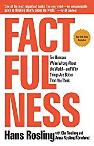

# Factfullness Quiz Webapp - CodersCamp Project 2

Individual project created for CodersCamp 2019 (Team Warsaw). :bomb:
This is a simple single-choice quiz web application built with Javascript, HTML, CSS. 
Quiz questions come from famous Factfullness Quiz created by Hans Rosling.

**Live:** [https://natkalia.github.io/coderscamp-project2/](https://natkalia.github.io/coderscamp-project2/)
	
## Technologies

The app is built with:
* HTML
* CSS
* Javascript

## Installation

### Online
You can play online quiz here [https://natkalia.github.io/coderscamp-project2/](https://natkalia.github.io/coderscamp-project2/)

### Locally
You can download a zip archive or clone repository from Github to your local envirnoment.
To download zip archive just click download and unzip it locally.
To clone you need to click clone to get repository address and run in your command line:
```bash
git clone https://natkalia.github.io/coderscamp-project2/
```
No further installations are required. You can just open the starter file - index.html in your favourite webbrowser.

## Features

The app was created according to CodersCamp guidelines that it should demonstrate following Javascript features:
* variables
* comparison operators
* == vs ===
* loops
* iterations/iterators
* arrays
* objects, properties
* conditional statements
* functions
* logical operators

## How to play the quiz

1. This is a simple quiz with only singe-choice answers.
2. It is not required that user answers all the questions. However, no response is counted as bad response.
3. When a question is answered by the user, it is marked with some styling to make it easy differentiating between answered and non-answered questions.
4. After completing the quiz and clicking the button "check answers" user is redirected to top, and his/her results are presented with personalized message. Message depends on the ratio of correct answers to total amswers. Also, all the answers are marked either green or red to show which answers were corrected and which not.
5. User can click "reset quiz" button and play again. All the previous styling used to show if user already answered a question and which answers were correct/incorrect is reset as well.
6. Button "check answers" is displayed all the time in the app. Reset button is shown only after "check answers" is clicked. Then, if the user decides to click reset button in order to play again, the reset button hides again.

Here some screetshots of quiz in action:


Hope you will enjoy it!

## Browser compatibility

The app was tested on the newest available versions of:
* Google Chrome (desktop) 
* Firefox (desktop)
* Opera (desktop)

The app is not compatible with:
* Internet Explorer
* Edge

## Credits

* Images from: [https://factfulnessquiz.com/](https://factfulnessquiz.com/)
* Quiz questions from: [https://factfulnessquiz.com/](https://factfulnessquiz.com/)

## About CodersCamp

This is the 5th edition od the camp. 
More info about the camp: [https://coderscamp.edu.pl/](https://coderscamp.edu.pl/)

## About Hans Rosling and Factfullness concept
It is recommended to read Hans Rosling book to better understand the factfullness concept:
